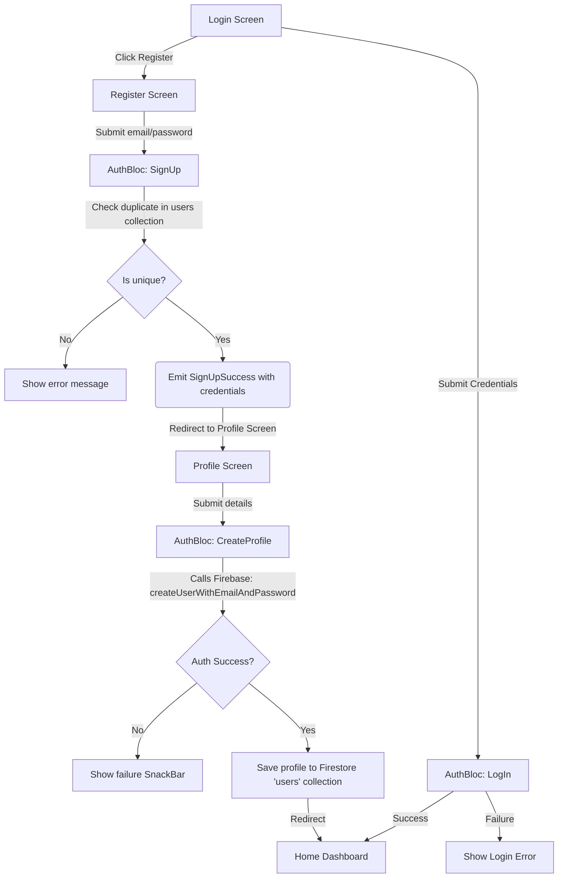

# Mockit Authentication App

A modern, premium Flutter mobile application featuring deferred user registration, clean feature-first architecture, functional programming paradigms via `Dartz` (`Either`), and Firebase integration (Auth & Firestore).

---

## 🏗️ Architectural Flow

To ensure high data integrity and a seamless user experience, the authentication and profile creation flow is structured as follows:



1.  **Register Page**: Checks if the email is a duplicate in the Firestore database. On confirmation of uniqueness, it navigates to the Profile creation page, passing the credentials.
2.  **Profile Page**: Prefills the verified email as read-only. When the user completes their profile, it initiates the `CreateProfile` event, creating the credential record in Firebase Auth first, and then storing the profile details inside the Firestore `users` collection.
3.  **Home Page**: Queries the current authenticated user's profile document from Firestore using the email value, displaying personal information and selected languages (rendered as modern chips).

---

## 📦 Core Packages Used

*   **`flutter_bloc`**: Predictable state management following the BLoC design pattern.
*   **`dartz`**: Introduces functional programming features to Dart. Uses the `Either` type to represent success (`Right`) or failure (`Left`) conditions natively in repository signatures.
*   **`go_router`**: Handles query parameter passing, deep-linking, and clean page route transitions.
*   **`get_it`**: Lightweight service locator for dependency injection.
*   **`firebase_core` & `firebase_auth` & `cloud_firestore`**: Provides authorization services and real-time document storage.

---

## 🔧 Setup & Installation

### 📋 Prerequisites
*   [Flutter SDK](https://docs.flutter.dev/get-started/install) (v3.33.0 or higher recommended)
*   Dart SDK

### 🛠️ Step-by-Step Setup

1.  **Get Dependencies**:
    Download the package configurations:
    ```bash
    flutter pub get
    ```

2.  **Ensure Firebase Config**:
    Verify options mapping inside `lib/firebase_options.dart` (preconfigured for Firebase Project `mockito-181d6`).

3.  **Run static analysis**:
    ```bash
    flutter analyze
    ```

4.  **Run the application**:
    ```bash
    flutter run
    ```
